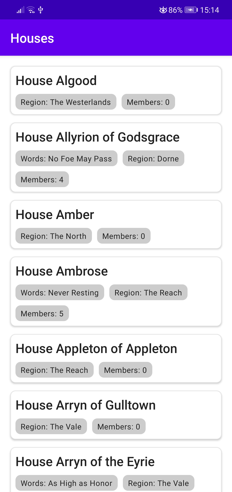
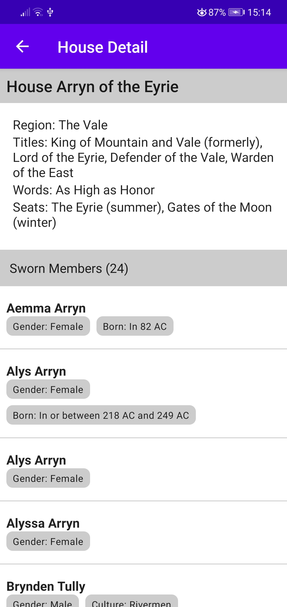
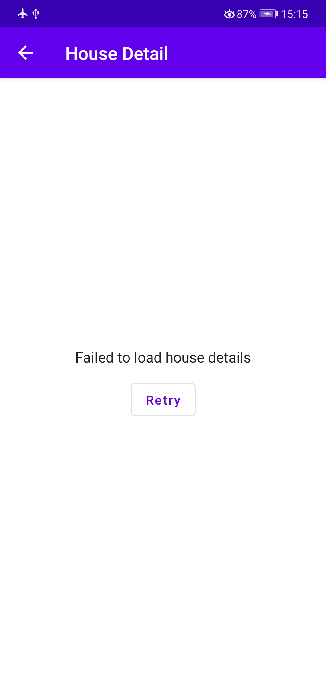

# jetpack_compose_sample
This sample app demonstrates the new architecture standards in android by using hilt and jetpack compose [Learning Purpose]
Architecture is based on https://github.com/android/architecture-samples

App uses https://anapioficeandfire.com/ api to fetch game of thrones data.
It has 2 basic screens, one displays the complete house list in the api by using android Paging lib and 
the other one displays the house details by fetching all related characters in that house. 

# Screenshots
| Houses  | Details | Error Case |
| ------------- | ------------- | ------------- |
|  |  |  |

# Testing
Only a few unit tests added for house detail view model to learn the testing basics for coroutine & flows

# TBD
Right now single source of truth is the remote api, later it would be nice to cache all responses in Room database and 
provide the single source from db as Flow type.

Also adding integration tests for verifying the houses and house detail screens will be beneficial 
